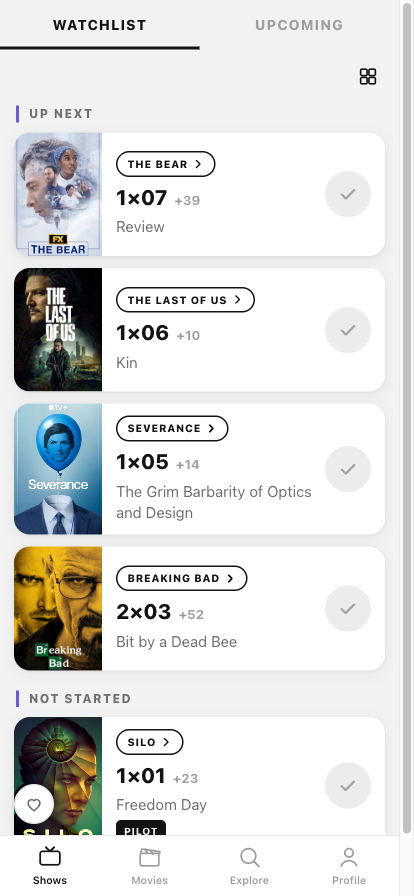

# FilmTable

A personal TV series and movie tracker, written after TV Time shut down. It runs
on **Android, iPhone and the web** from a single codebase, **with no backend for
your data**: the library is stored on the device and metadata comes from free APIs.

**Try it:** [film-table.vercel.app](https://film-table.vercel.app) (web / PWA) ·
[iPhone beta on TestFlight](https://testflight.apple.com/join/QvqtTn6U) ·
[product page](https://mrwd.github.io/products/film-table/)



More screenshots, as prepared for the store listings, are in
[docs/store/screenshots](docs/store/screenshots).

The previous address — [mrwd.github.io/film-table](https://mrwd.github.io/film-table/)
— still works and stays up for the libraries built there: browser storage is tied
to a domain and does not move on its own.

A free fan project. Not affiliated with TV Time or Whip Media.

## Features

- **Shows / Watchlist** — Up Next, Not Started and Been a While sections; a card
  shows the next episode (`3×01 +3`), one-tap check-in with Undo, and a list/grid
  toggle.
- **Shows / Upcoming** — upcoming episodes of your shows: Today / weekday / Later,
  the time and channel, a "7 DAYS" countdown, and PREMIERE / NEW / AIRED / LATEST
  badges.
- **Show page** — x/y progress, a "Check in" button, seasons that can be marked as
  a whole, an episode list with dates, and Stop watching / Resume / Remove.
- **Movies** — watch list / watched, with unreleased films counting down to
  release.
- **"For you" recommendations** — picks based on your library, entirely on the
  client. The taste profile is built from the genres of what you have watched,
  weighted by episode count and recency; dropped shows act as a negative signal.
  Candidates come from Cinemeta's genre catalogues and are ranked by cosine
  similarity to the profile plus rating and year proximity. Every card states why
  it was suggested.
- **Explore** — search with three tabs, **ALL / SHOWS / MOVIES**: in the combined
  tab, shows and movies appear in a single list with a type icon and exact matches
  at the top. Plus the Airing tonight and Popular this week collections.
- **Profile** — time and episode statistics, shelves by status, **JSON backup
  export/import**, and a full reset.
- **Theme** — light and dark. By default it follows the device setting, but
  Profile → Appearance can pin either one independently of the system. The choice
  is saved and applied before the first paint, so there is no flash of a light
  background at startup.
- **PWA** — installs to the iPhone/Android home screen and works offline (service
  worker).
- **Native apps** — the same code wrapped with Capacitor for iOS and Android. The
  native build adds episode reminders (local notifications computed from air dates,
  no push server), a home-screen widget with the Up Next queue (`ios/App/FilmTableWidget`),
  and on-device AI on iPhones that have it: a spoiler-free recap, a pasted-list
  import, the year in words, and translation of descriptions. Nothing is sent
  anywhere.
- **Where to watch** — streaming availability per country from TMDB's JustWatch
  feed, when the TMDB proxy is reachable.

## Data

| Source | What | Key |
|---|---|---|
| [TVmaze API](https://www.tvmaze.com/api) | shows: seasons, episodes, air times, schedule (CC BY-SA) | not required |
| Cinemeta | a catalogue of films and shows with posters and IMDb ids | not required |
| iTunes Search API | films that Cinemeta does not have | not required |

The sources **complement** each other rather than replacing one another:

- **Movies** — Cinemeta provides the main catalogue and iTunes adds what only it
  knows. That came about because the iTunes `media=movie` filter currently returns
  zero results for any query, and without the filter the results are packed with
  podcasts and audiobooks: "spider-man" yielded only 4 films out of 200 results,
  and "the matrix" was not found at all.
- **Shows** — TVmaze limits search to 10 results, so the results are widened with
  the Cinemeta catalogue, and shows found there are matched to TVmaze by IMDb id
  (`/lookup/shows?imdb=`). Episodes and air times always come from TVmaze, where
  they are more accurate.
- Supplementary sources are wrapped in a timeout, so a slow response never holds up
  the main results.

User data lives only on the device: IndexedDB in a browser (the `filmtable-kv`
database with the `filmtable-library-v1` / `filmtable-cache-v1` keys), a JSON file
in private app storage in the native apps. The storage adapter is shared with the
sibling trackers through [tables-core](https://github.com/mrWD/tables-core). There
is no sync between devices — move your library via Profile → Export/Import.

## Running locally

```bash
npm install
npm run dev        # http://localhost:5173
```

Production build:

```bash
npm run build      # static files in dist/
npm run preview    # http://localhost:4173
```

`scripts/gen-icons.mjs` regenerates the PNG icons from `public/favicon.svg`
(requires the sharp dev dependency).

## Deployment

Two addresses at once, both updated on a push to `main`:

- **Vercel** — the primary one. Static files and the `/api/tmdb` function under a
  single domain; the TMDB key lives in the environment variables and never reaches
  the browser.
- **GitHub Pages** — the previous one. `.github/workflows/deploy.yml` builds and
  publishes it; the subpath is injected via `BASE_PATH` (`/film-table/`). The build
  is given `VITE_API_BASE` pointing at the Vercel proxy, so TMDB works there too.

```bash
git push          # both are updated in about a minute
```

Routing is hash-based and no SPA fallback is needed, so the static files port to
any host. TMDB, however, needs a function at the `/api/tmdb` path — without it the
app still works, it just silently falls back to the key-free sources. Details are
in [docs/DEPLOY.md](docs/DEPLOY.md).

## Installing on a phone

Open <https://film-table.vercel.app> and add it to the home screen:

- **iPhone (Safari)**: Share → "Add to Home Screen"
- **Android (Chrome)**: the ⋮ menu → "Add to Home screen" (or the "Install"
  banner)

The app gets an icon, opens in full-screen mode and works offline.

## Limitations and plans

- Cinemeta is a public key-free catalogue with no availability guarantees. If it
  responds slowly or is down, the app keeps working: TVmaze fully covers shows and
  iTunes covers films. TMDB can be added here as well if wanted (a free key is
  entered in the Profile and stored only on the device) — the source architecture
  already allows for it.
- There is no cloud sync (no backend, by design) — manual backups instead.
- The iOS app is in open TestFlight beta; an App Store release and a Google Play
  build are the next steps. The Android project builds and runs, but is not
  published yet.

## Documentation

| File | What it covers |
|---|---|
| [CLAUDE.md](CLAUDE.md) | brief project context, principles, branch status |
| [docs/ARCHITECTURE.md](docs/ARCHITECTURE.md) | code structure, data model, algorithms |
| [docs/DATA-SOURCES.md](docs/DATA-SOURCES.md) | the APIs and their quirks, confirmed by measurements |
| [docs/DECISIONS.md](docs/DECISIONS.md) | why it is built this way, and the pitfalls already hit |
| [docs/DEPLOY.md](docs/DEPLOY.md) | the two addresses, environment variables, production checks |
| [docs/RELEASE-IOS.md](docs/RELEASE-IOS.md) | building and signing the iOS app for TestFlight |
| [docs/STORE.md](docs/STORE.md) | store listing texts, categories, screenshots |
| [docs/PLAN.md](docs/PLAN.md) | the original plan (a historical document) |

## Layout

```
api/tmdb.js   serverless proxy to TMDB (Vercel)
src/lib/      types, API clients, storage, native bridges, genre reconciliation, formatting
src/store/    zustand: library and cache (persist), explore, recommend, theme, ui
              selectors.ts — all derived logic as pure functions
src/components/ icons, UI primitives, cards, recap, year review, feedback
src/pages/    Shows / Movies / Explore / ShowDetail / MovieDetail / Profile
ios/, android/  Capacitor projects; ios/App/FilmTableWidget is the WidgetKit widget,
              AIBridge / TranslateBridge / WidgetBridge are the Swift bridges
docs/         architecture, data sources, decisions, deploy, release, store
```
